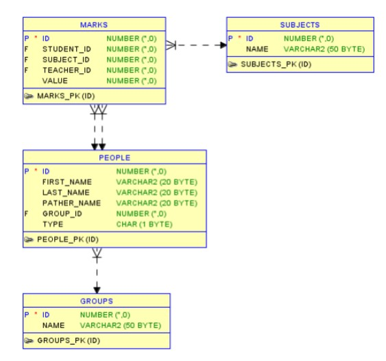
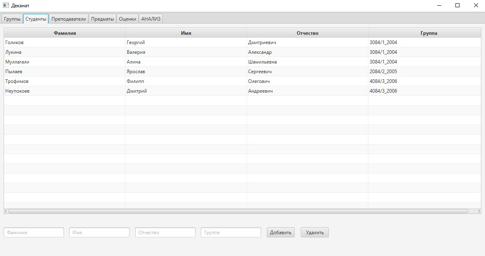
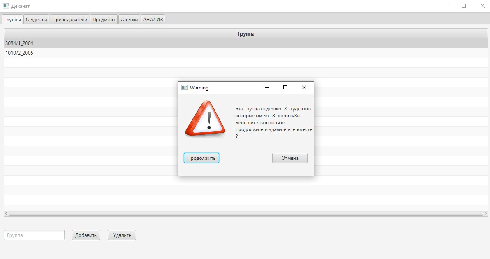
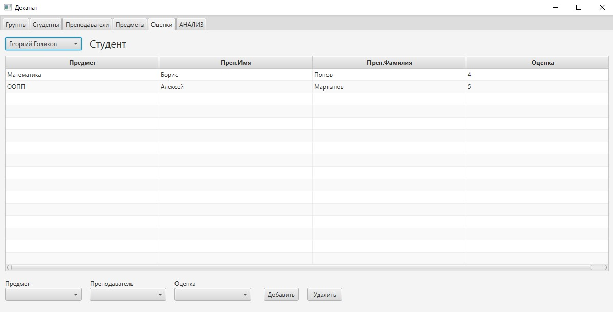
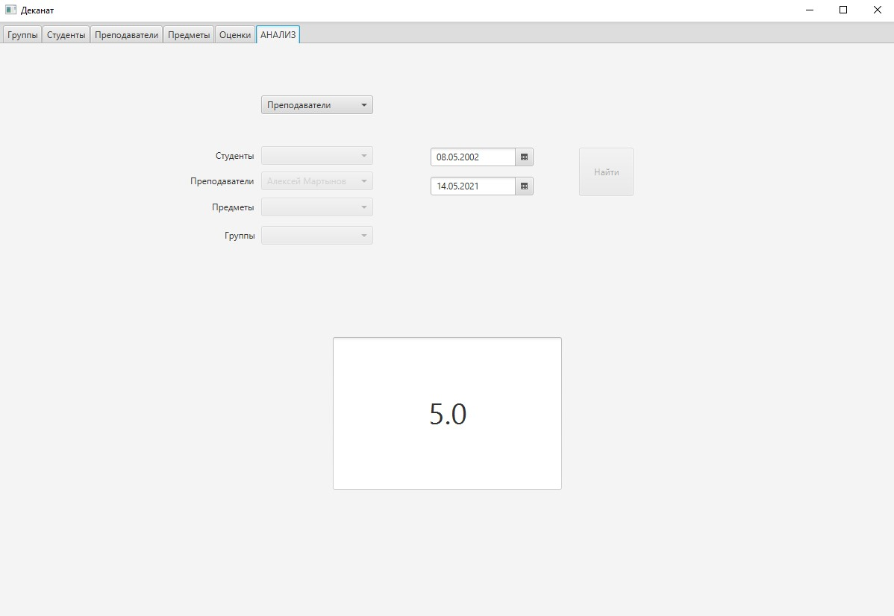

# Автоматизация работы деканата
* Управление студентами, группами, предметами и анализ успеваемости.
* Клиентское десктоп **JavaFX** приложение, работающее с базой данных **Oracle** через соответствующий драйвер **JDBC**.
## :arrow_down: Зависимости
Для запуска проекта в IntelliJ IDEA необходимо скачать и установить:
* [Драйвер Oracle JDBC](https://www.oracle.com/database/technologies/appdev/jdbc-downloads.html)
* [JavaFX Runtime](https://gluonhq.com/products/javafx/)
* [Scene Builder](https://gluonhq.com/products/scene-builder/) - для редактирования fxml файлов
## :hammer: Технологии и паттерны
Приложение построено с помощью фреймворка **JavaFX**. Работа с базой данных производится через **JDBC** Driver, поэтому **SQL** запросы были написаны вручную и вынесены в хранимые процедуры. В реализации не обошлось без применения следующих **шаблонов проектирования**:
* **Data Access Object (DAO)** - соединение с базой данных
* **Model-View-Controller (MVC)** - архитектурный принцип приложения
* **Facade** - бизнес логика вынесена в слой сервисов, через который контроллер взаимодействует с БД
## :books: Схема базы данных

## :camera: Скриншоты приложения
### Студенты

### Группы

### Оценки

### Анализ успеваемости

